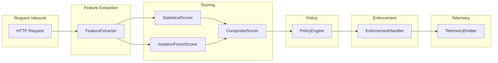

# ai-sentinel v1 Architecture Plan

A modular Spring Boot starter for AI-assisted zero-trust API defense, separating feature extraction, scoring, policy, enforcement, and telemetry with clean interfaces, lightweight unsupervised ML (statistical + Isolation Forest), and strict <5ms scoring latency guarantees.

---

## Design Goals Alignment

| Principle | Implementation Strategy |
|-----------|-------------------------|
| Continuous behavioral anomaly detection | Per-request feature extraction + rolling baseline |
| Adaptive enforcement | Risk-level thresholds drive dynamic actions |
| Privacy-aware features | Hashed identities, bucketed IPs, no raw PII |
| Lightweight ML | Statistical z-score + Isolation Forest (SMILE/java-decision-forest) |
| In-process | Single JVM, no network calls in hot path |
| <5ms latency | Bounded structures, lock-free where possible, timeout + fail-open |
| Deterministic scoring | Fixed random seed for IF; z-score is deterministic |
| Extension points | SPI-style interfaces for all ML/policy components |

---

## Module Layout

```
ai-sentinel/
├── ai-sentinel-core/              # Feature extraction, scoring, policy, enforcement
├── ai-sentinel-spring-boot-starter/  # Auto-config, filter, properties
├── ai-sentinel-demo/              # Sample API + simulated attack scenarios
└── ai-sentinel-dashboard/         # Optional visualization (can defer to v1.1)
```

---

## Request Lifecycle (Data Flow)



All steps run synchronously in the filter; each step is timeout-bounded to meet <5ms total.

---

## 1. Feature Extraction

**Interface:** `FeatureExtractor`

```java
public interface FeatureExtractor {
    RequestFeatures extract(HttpServletRequest request, String identityHash, RequestContext ctx);
}
```

**Extracted features (privacy-aware, numeric only):**

| Feature | Description | Privacy |
|---------|-------------|---------|
| `requestsPerWindow` | Count for identity in sliding window | Identity hashed |
| `endpointEntropy` | Endpoint traversal entropy | No PII |
| `tokenAgeSeconds` | Token/session age | No raw token |
| `parameterCount` | Query + form param count | No values |
| `payloadSizeBytes` | Request body size | No content |
| `headerFingerprintHash` | Bucketed header consistency | Bucketed |
| `ipBucket` | Bucketed IP (e.g. /24) | No raw IP |

**Implementation:** `DefaultFeatureExtractor` — composable extractors via `FeatureProvider` SPI.

---

## 2. Scoring

**Interface:** `AnomalyScorer`

```java
public interface AnomalyScorer {
    double score(RequestFeatures features);
    void update(RequestFeatures features);  // optional incremental update
}
```

**Implementations:**

1. **Statistical Baseline Scorer** — Rolling mean/std per `(identityHash, endpoint)`; anomaly via z-score
   - Deterministic.
   - `update()`: incremental mean/std (Welford).
2. **Isolation Forest Scorer** — Use SMILE `IsolationForest` or java-decision-forest
   - Fixed random seed for reproducibility.
   - Model retrained periodically (async, separate thread); inference only in hot path.
   - Extension point: `AnomalyScorerFactory` to swap implementations.

**Composite Scorer:** Weighted combination of scorers.  
**Output:** Normalized risk score in [0.0, 1.0] for policy use.

**Latency budget:** ~2ms extraction, ~2ms scoring, ~0.5ms policy/enforcement, ~0.5ms telemetry. Timeout per stage with fail-open (allow request on timeout/exception).

---

## 3. Policy Engine

**Interface:** `PolicyEngine`

```java
public interface PolicyEngine {
    EnforcementAction evaluate(double riskScore, RequestFeatures features, String endpoint);
}
```

**Risk tiers (from design_info.txt Section 4.4):**

| Risk Level | Score Range | Action |
|------------|-------------|--------|
| Low | [0.0, 0.2) | Allow |
| Moderate | [0.2, 0.4) | Allow + enhanced logging |
| Elevated | [0.4, 0.6) | Adaptive throttling |
| High | [0.6, 0.8) | Temporary block |
| Critical | [0.8, 1.0] | Quarantine session |

**Implementation:** `ThresholdPolicyEngine` — configurable thresholds, pluggable action mapping.

---

## 4. Enforcement

**Interface:** `EnforcementHandler`

```java
public interface EnforcementHandler {
    void apply(EnforcementAction action, HttpServletRequest request, HttpServletResponse response);
    boolean allowsProceeding(EnforcementAction action);
}
```

**Actions:** Allow, LogOnly, Throttle, Block, Quarantine.  
**Handler chain:** Each action type implemented by a dedicated handler (e.g. `ThrottlingHandler`, `BlockingHandler`).  
**Adaptive throttling:** Rate limit derived from risk score (e.g. lower limit for higher score).

---

## 5. Telemetry

**Interface:** `TelemetryEmitter`

```java
public interface TelemetryEmitter {
    void emit(TelemetryEvent event);
}
```

**Event types:** `ThreatScored`, `AnomalyDetected`, `PolicyActionApplied`, `QuarantineStarted`.  
**Sinks:** SLF4J (JSON structured), Micrometer metrics (Prometheus), optional OpenTelemetry.  
**Failure handling:** Fire-and-forget; telemetry failures do not affect request processing.

---

## 6. Spring Boot Integration

**ai-sentinel-spring-boot-starter:**

- `SentinelFilter` extends `OncePerRequestFilter`
  - Order after auth filters (e.g. `SecurityContextHolder` populated).
  - Excludes actuator, static resources, health by default.
- Auto-configuration: `@ConditionalOnProperty`, `@EnableConfigurationProperties`.
- Properties prefix: `ai.sentinel.*` — enable/disable, thresholds, timeout, exclusion patterns.
- Actuator endpoint: `/actuator/sentinel` — health, stats, optional model info.

---

## 7. Fail-Safe and Observability

- **Timeout:** Per-request scoring timeout (e.g. 4ms); on expiry, allow request and emit metric.
- **Exception handling:** Catch all in filter; allow request; log; increment failure metric.
- **Circuit breaker:** Optional; if failure rate exceeds threshold, short-circuit scoring and allow.
- **Metrics:** `sentinel.scoring.latency`, `sentinel.risk.score`, `sentinel.action.*`, `sentinel.errors`.

---

## 8. Extension Points

| Extension | Interface | Use Case |
|-----------|-----------|----------|
| Feature | `FeatureProvider` | Add new features |
| Scorer | `AnomalyScorer` | Swap/add ML models |
| Policy | `PolicyEngine` | Custom risk tiers |
| Enforcement | `EnforcementHandler` | Custom actions |
| Telemetry | `TelemetryEmitter` | Custom sinks |

All wired via Spring `@ConditionalOnMissingBean` so users can override defaults.

---

## 9. Dependencies

- **ai-sentinel-core:**
  - SMILE `smile-math`, `smile-data` (or java-decision-forest for minimal deps).
  - SLF4J, Micrometer (optional).
- **ai-sentinel-spring-boot-starter:**
  - Spring Boot 3.x, spring-boot-starter-web, spring-boot-actuator.
  - Depends on ai-sentinel-core.
- **ai-sentinel-demo:**
  - Spring Boot + ai-sentinel-spring-boot-starter.

---

## 10. Testability

- **Unit tests:**
  - Feature extractors (mock `HttpServletRequest`).
  - Scorers (fixed feature vectors).
  - Policy engine (boundary tests for thresholds).
  - Enforcement handlers (mock request/response).
- **Integration tests:**
  - Filter chain with mock traffic; assert latency and fail-open on timeout.
  - Demo app: simulate credential stuffing, parameter tampering; assert risk elevation and actions.

---

## 11. Implementation Order

1. **ai-sentinel-core** — `RequestFeatures` DTO, `FeatureExtractor` + `DefaultFeatureExtractor`, `StatisticalScorer`, `IsolationForestScorer`, `CompositeScorer`, `PolicyEngine`, `EnforcementHandler`, `TelemetryEmitter`.
2. **ai-sentinel-spring-boot-starter** — Auto-config, `SentinelFilter`, properties.
3. **ai-sentinel-demo** — Sample API, simulated attacks, basic evaluation scenarios.
4. **ai-sentinel-dashboard** — Deferred or minimal v1 scope (actuator metrics + Grafana dashboard JSON).

---

## Key Files to Create

| Module | Key Classes |
|--------|-------------|
| core | `FeatureExtractor`, `RequestFeatures`, `AnomalyScorer`, `StatisticalScorer`, `IsolationForestScorer`, `CompositeScorer`, `PolicyEngine`, `EnforcementHandler`, `TelemetryEmitter` |
| starter | `SentinelAutoConfiguration`, `SentinelFilter`, `SentinelProperties` |
| demo | `DemoApplication`, `AttackSimulator` (credential stuffing, scraping, tampering) |
