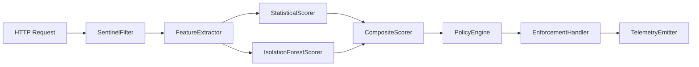

# AI-Sentinel — Architecture (as implemented)

This document describes the **current** runtime architecture of the AI-Sentinel Spring Boot starter and core library. It replaces earlier design-only notes (e.g. external ML libraries or modules that were never added to this repository).

---

## 1. Goals (engineering)

| Goal | How it is addressed |
|------|---------------------|
| Behavioral anomaly signals | Per-request features + rolling state keyed by hashed identity (and endpoint where configured) |
| Adaptive enforcement | `PolicyEngine` maps a scalar score in `[0,1]` to `EnforcementAction` |
| Privacy-oriented features | No raw tokens or bodies in feature vectors; IP bucketing and header fingerprint hashing |
| In-process scoring | No network I/O on the hot path for scoring |
| Replaceable components | Spring `@ConditionalOnMissingBean` on pipeline pieces (extractor, scorers, policy, enforcement handler, metrics) |
| Operability | Micrometer metrics, `/actuator/sentinel`, structured telemetry |

Latency is optimized with bounded maps, careful locking, and lock-free IF inference after model swap, but **there is no hard per-request timeout** in code today—treat sub‑5 ms as a design aspiration, not a guaranteed SLA.

---

## 2. Repository layout

```
ai-sentinel/
├── ai-sentinel-core/                 # Framework-agnostic engine
├── ai-sentinel-spring-boot-starter/  # Servlet filter, auto-config, actuator, Micrometer
├── ai-sentinel-trainer/              # Optional app: Kafka consumer, IF training, filesystem registry publisher
├── ai-sentinel-demo/                 # Reference application
└── scripts/                          # Optional Python traffic / training helpers
```

There is **no** `ai-sentinel-dashboard` module; visualize via Prometheus/Grafana or logs.

---

## 3. Request lifecycle

**HTTP path (simplified):**

```
Client
  ↓
SentinelFilter
  ↓
Feature extraction → Scoring → Policy → Enforcement
```

**Optional training / registry path** (async and off-request for registry refresh; not on the servlet hot path for model fetch):

```
TrainingCandidatePublisher → Kafka (optional) → ai-sentinel-trainer → filesystem registry → ModelRefreshScheduler → IsolationForestScorer
```



1. **`SentinelFilter`** resolves identity (client IP via **`ClientIpResolver`** when proxies are trusted, plus optional Spring Security principal), skips excluded paths, then runs the pipeline.
2. **`SentinelPipeline`** extracts features, scores, evaluates policy, applies enforcement, emits telemetry, and records metrics (including fail-open paths on errors).

---

## 4. Feature extraction

**Interface:** `FeatureExtractor`

```java
RequestFeatures extract(HttpServletRequest request, String identityHash, RequestContext ctx);
```

**`DefaultFeatureExtractor`** builds `RequestFeatures` with:

| Field | Role |
|-------|------|
| `requestsPerWindow` | Rate signal from `BaselineStore` |
| `endpointEntropy` | Entropy over recent endpoints for the identity |
| `tokenAgeSeconds` | Derived from request metadata where available |
| `parameterCount` | Query/form parameter count (not values) |
| `payloadSizeBytes` | Body size |
| `headerFingerprintHash` | Stable hash of selected header names/presence |
| `ipBucket` | Coarse IP bucket |

There is no **`FeatureProvider` SPI** in the codebase; extend by supplying your own `@Bean` `FeatureExtractor`.

---

## 5. Scoring

### 5.1 Statistical scorer

**`StatisticalScorer`** maintains Welford mean/variance per key (bounded maps + TTL), converts z-scores to a bounded score, and applies **warmup** (`warmupMinSamples`, `warmupScore`) when data is sparse.

It consumes the **full** `RequestFeatures.toArray()` (seven dimensions including hash and IP bucket).

### 5.2 Isolation Forest (optional)

**`IsolationForestScorer`** uses a **minimal in-core** Isolation Forest (no Smile / java-decision-forest dependency):

- Training samples are **`RequestFeatures.toIsolationForestArray()`** — **five** behavioral features only (`requestsPerWindow`, `endpointEntropy`, `tokenAgeSeconds`, `parameterCount`, `payloadSizeBytes`). Hash and IP bucket ordinals are **excluded** to avoid wasting splits on weak features.
- **`BoundedTrainingBuffer`** caps stored vectors; **`IsolationForestRetrainScheduler`** (starter) retrains on an interval when isolation forest is enabled **and** filesystem model-registry refresh is **not** fully wired (`refresh-enabled` + non-empty `filesystem-root`), so only one background path swaps the model. Property **`ai.sentinel.isolation-forest.local-retrain-enabled`** can disable local retrain explicitly. **`ModelRefreshScheduler`** installs registry artifacts off-request (immediate tick at startup plus poll interval). Swap to a new model is atomic for readers.
- If no model is loaded, a configurable **fallback score** is returned so the composite scorer still behaves predictably.
- When a model exists, high-scoring requests can be **rejected from the training buffer** (anti-poisoning).

### 5.3 Composite scorer

**`CompositeScorer`** weights the statistical scorer (weight `1.0`) and optionally the IF scorer (`isolation-forest.score-weight`). NaN/negative scores are clamped toward high risk before policy.

---

## 6. Policy

**`ThresholdPolicyEngine`** implements **`PolicyEngine`**:

| Band (default boundaries) | Action |
|---------------------------|--------|
| `[0, t_moderate)` | ALLOW |
| `[t_moderate, t_elevated)` | MONITOR |
| `[t_elevated, t_high)` | THROTTLE |
| `[t_high, t_critical)` | BLOCK |
| `[t_critical, 1]` | QUARANTINE |

Thresholds **`threshold-moderate`** … **`threshold-critical`** are configured via `ai.sentinel.*` and validated at startup (strictly increasing, in `[0,1]`, finite).

---

## 7. Enforcement

- **`CompositeEnforcementHandler`** — token-bucket throttle, HTTP block with configurable status, quarantine with TTL; maps bounded by `internalMapMaxKeys` / `internalMapTtl`.
- **`MonitorOnlyEnforcementHandler`** — wraps the composite handler in **MONITOR** mode (no hard blocks; still records intent for telemetry).
- **`StartupGrace`** — after application start, can force monitor-only behavior for a configurable duration (`startup-grace-period`).
- **`EnforcementScope`** — throttle/quarantine keys may be **per identity** or **per identity + endpoint**.

---

## 8. Identity and proxies

**`ClientIpResolver`** (used from **`SentinelFilter`**):

1. If `trusted-proxies` is empty, or the TCP remote address is **not** trusted → **`getRemoteAddr()`** (headers ignored).
2. If trusted → parse **`X-Forwarded-For`** (rightmost-untrusted hop), then **`Forwarded`** (`for=`), then **`X-Real-IP`** **only if** there is no “forward-chain hint” (no non-blank `X-Forwarded-For` or `Forwarded` header). Otherwise fall back to **`getRemoteAddr()`** so clients cannot spoof `X-Real-IP` alongside dummy forward headers.

Trusted entries may be literal IPs or **CIDR** prefixes.

---

## 9. Spring Boot integration

- **`SentinelAutoConfiguration`** registers the pipeline, filter, baseline store, scorers, policy engine (from properties), enforcement beans, telemetry, optional IF scheduler, and **`MicrometerSentinelMetrics`** when a **`MeterRegistry`** exists.
- **`SentinelProperties`** binds `ai.sentinel.*` (relaxed names, e.g. `isolation-forest.enabled`).
- **`SentinelEndpointAutoConfiguration`** exposes **`@Endpoint(id = "sentinel")`** → **`/actuator/sentinel`**.
- Filter order is intended to run **after** authentication filters where **`SecurityContextHolder`** is populated (see starter code comments).

---

## 10. Distributed architecture

Phase 5 adds **optional** coordination and training paths that do not change local scoring or policy math on the request hot path. Features are gated by `ai.sentinel.distributed.*`, `ai.sentinel.model-registry.*`, and trainer `aisentinel.trainer.*` properties.

| Component | Role |
|-----------|------|
| **Cluster quarantine (read)** | `ClusterQuarantineReader` merges Redis into `isQuarantined` (OR with local), fail-open. |
| **Cluster quarantine (write)** | After a real local `QUARANTINE`, async publish of `until` to Redis for peers. |
| **Cluster throttle** | On **THROTTLE** only, optional **`ClusterThrottleStore`** (Redis fixed-window counter) before the local bucket; fail-open. |
| **Training candidate publishing** | **`TrainingCandidatePublisher`** — async export after enforcement (log or Kafka). |
| **Trainer** (`ai-sentinel-trainer`) | Optional Kafka consumer, bounded buffer, IF train, writes `{tenant}/active.json` + artifacts under a **filesystem** registry root. |
| **Model registry** | **`ModelRegistryReader`** + **`FilesystemModelRegistry`** read pointers and payloads from that layout. |
| **Model refresh** | **`ModelRefreshScheduler`** on serving nodes polls off-request and calls **`IsolationForestScorer.tryInstallFromRegistry`**. |

**End-to-end flow (when enabled):** starter **nodes** → **publish** candidates (Phase 5.5) → **trainer** consumes and trains → **writes** registry artifacts → starter **nodes** **refresh** and install models (Phase 5.6). Redis and Kafka are optional; log transport and local-only operation remain valid.

Local enforcement stays authoritative; Redis and transport failures are fail-open. Property names and validation scope: root [`README.md`](README.md).

---

## 11. Observability

- **`DefaultTelemetryEmitter`** — JSON logs + Micrometer counters for events (verbosity and sampling configurable).
- **`MicrometerSentinelMetrics`** — registers meters such as `aisentinel.score.composite`, `aisentinel.score.statistical`, `aisentinel.score.if`, `aisentinel.latency.pipeline`, `aisentinel.latency.scoring`, `aisentinel.latency.if`, per-action counters, retrain timers/counters, `aisentinel.failopen.count`, etc., with percentiles where applicable.
- **`/actuator/sentinel`** aggregates config flags, quarantine/throttle counts, IF training state, **score/latency summaries** when the Micrometer adapter is present, and **`lastScoreComponents`** (statistical vs optional IF vs blended composite from the **most recent** `CompositeScorer` evaluation—useful for quick A/B-style checks alongside `aisentinel.score.*` meters).

---

## 12. Extension points (beans)

| Override | Interface / type |
|----------|------------------|
| Features | `FeatureExtractor` |
| Scoring | `AnomalyScorer` / register additional scorers only via custom `CompositeScorer` bean |
| Policy | `PolicyEngine` |
| Enforcement | `EnforcementHandler` (or wrap `CompositeEnforcementHandler`) |
| Telemetry | `TelemetryEmitter` |
| Metrics | `SentinelMetrics` |
| Training export | `TrainingCandidatePublisher` (default noop) |
| Cluster throttle store | `ClusterThrottleStore` (default noop; Redis when wired) |
| Model registry read | `ModelRegistryReader` (default **`FilesystemModelRegistry`** when Phase 5.6 auto-config applies) |

**Wiring:** Spring Boot auto-configuration uses **`@ConditionalOnMissingBean`** on these types (see `SentinelAutoConfiguration`, `ModelRegistryAutoConfiguration`, and distributed packages). Provide your own bean of the same type to replace the default implementation.

---

## 13. Dependencies (reality)

- **ai-sentinel-core:** SLF4J, Micrometer Core, Jakarta Servlet API (provided), Lombok (provided), JUnit/Mockito/AssertJ (test).
- **ai-sentinel-spring-boot-starter:** Spring Boot Web, Actuator, Security (optional integration), Micrometer; depends on **ai-sentinel-core** only (not on the trainer).
- **ai-sentinel-trainer:** **ai-sentinel-core**, Spring Boot starter (`spring-boot-starter`), JSON (`spring-boot-starter-json`), Kafka (`spring-kafka`), Actuator, optional Micrometer Prometheus at runtime; Lombok (provided); test stack JUnit 5 / AssertJ / `spring-boot-starter-test`. Standalone deployable; **not** a transitive dependency of applications that only use the starter library.

---

## 14. Testing strategy

- **Unit tests** — `ai-sentinel-core`: scorers, policy boundaries, resolver logic, enforcement maps, IF buffer and retrain behavior, codec/metadata.
- **Spring slice tests** — `ai-sentinel-spring-boot-starter`: auto-configuration, actuator JSON shape, filter/proxy integration, model registry beans (`io.aisentinel.autoconfigure.model.*`).
- **Distributed / Redis** — `io.aisentinel.validation.*` and related tests: Testcontainers Redis (`@Testcontainers(disabledWithoutDocker = true)`). **Docker** (or a Docker-compatible CI agent) is required to run those tests; they are skipped when Docker is unavailable.
- **Trainer** — `ai-sentinel-trainer` unit tests (orchestrator, buffer, message parser).
- **Demo** — `DemoIntegrationTest` smoke test with embedded server.

---

## 15. Design evolution

The codebase grew from a **single-node** library (**Phases 0–4**: core engine, Spring integration, Isolation Forest, hardening) to **optional distributed** behavior in **Phase 5**: Redis-backed cluster quarantine and throttle, training candidate export, the **`ai-sentinel-trainer`** service, and filesystem model registry with node-side refresh (**Phase 5.6**). Older planning assumed external ML stacks and a dashboard module; the **current** tree uses an in-core Isolation Forest and Micrometer instead. **Phase 5.3** adds automated validation (single-JVM Testcontainers today). **Phase 6** may add tuning, alternative models, and operational tooling (see README roadmap). **Not** in the current codebase: central online inference; Redis/S3-backed artifact registries as first-class products.
